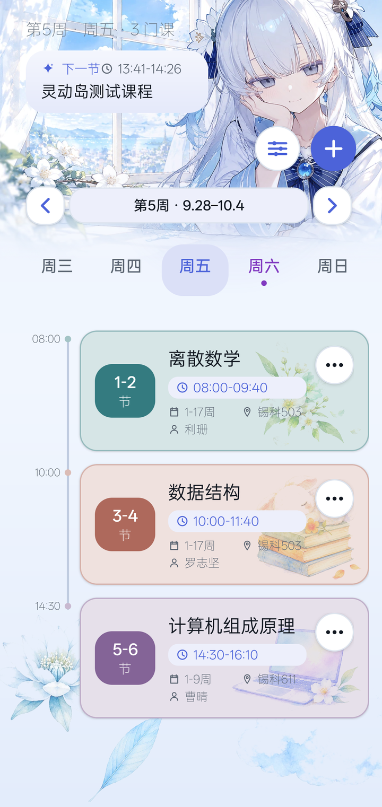
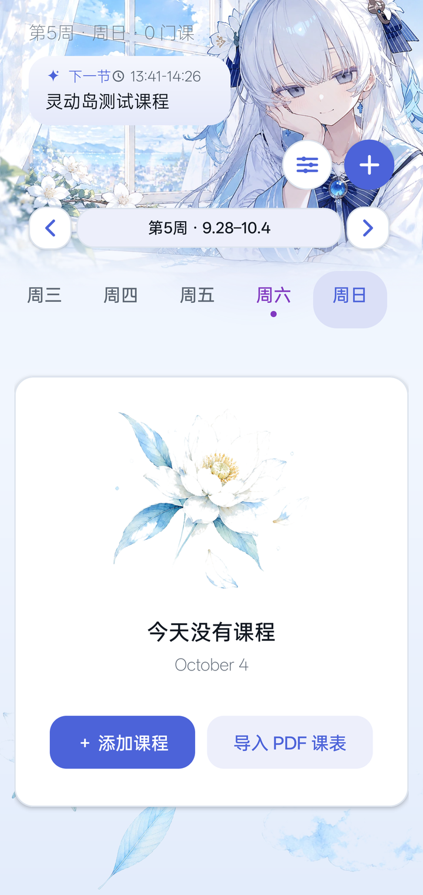

# 我的课表 · Mein Stundenplan

一个**完全离线**的原生 Android 课表应用：课程管理、学校 PDF 课表导入、校历周次计算、上课提醒与倒计时。
纯 Java + Material 组件，无任何网络权限、无第三方 SDK、无广告与统计。

> English: a fully offline native Android timetable app (Java, minSdk 23 / targetSdk 36).
> Courses are stored encrypted with the Android Keystore; the app requests no `INTERNET` permission.

- 当前版本：`1.2.2`（`versionCode 5`）
- 运行环境：Android 6.0（API 23）及以上，针对 Android 16（API 36）构建
- 预编译安装包：[releases/mein-stundenplan-v1.2.2.apk](releases/mein-stundenplan-v1.2.2.apk)
- 版本历史：[docs/CHANGELOG.md](docs/CHANGELOG.md)

## 界面预览

| 课程表 | 无课状态 |
| --- | --- |
|  |  |

蓝白冬雪莲水彩视觉：整张 Hero 插画（人物与窗景同一张画，四边出血顶满状态栏），
页面为连续的蓝白竖直渐变，左下/右下各有出血式水彩装饰；
课程卡片按课程着色（节次徽章、描边与右下角科目插画），
时间轴由时间、课程色圆点与一条贯穿竖线组成，进行中的课程带「当前」胶囊与倒计时。

## 功能特性

**课程管理**
- 周一至周日切换查看，打开应用自动定位当天
- 添加、编辑、删除课程：开始/结束节次、上课周次、课程名称、地点、教师、颜色
- 同一天、同节次、同周次自动阻止重复添加
- 周切换浏览：查看任意教学周的课表，可一键回到"本周"

**PDF 导入**
- 从学校导出的文字版课表 PDF 批量导入课程名称、上课周、地点、教师与节次
- 不申请读取外部存储权限，只通过系统文件选择器读取用户主动选中的文件
- 单个 PDF 限制 5 MB，压缩流与课程数量均有上限，避免异常文件耗尽内存

**校历与提醒**
- 手动设置开学日/散学日，总周数自动计算；周次、倒计时、提醒全部基于该校历
- 课程状态统一区分：未到提醒窗口、课前提醒、进行中、已结束
- 提醒支持后续周次续排、开机/升级后重排、通知与精确闹钟权限被拒时自动降级

**界面**
- 浅色蓝白视觉（冬雪莲水彩主题），Hero 插画与页面渐变一体呈现
- 今天用紫色标记并带圆点指示器，选中日期蓝色高亮
- 节次徽章、卡片阴影与统一对齐的布局；空状态配雪莲花水彩插画

## 隐私与安全

- 课程数据使用 **Android Keystore + AES/GCM** 加密保存，不落明文 JSON
- 旧版本明文数据首次运行会自动迁移到加密字段 `courses_encrypted_v2` 并删除旧字段
- 密钥丢失、密文损坏或数据被篡改时**暂停保存**，避免用空数据覆盖原始密文
- `android:allowBackup="false"`、`android:dataExtractionRules`、`android:usesCleartextTraffic="false"`
- 应用不持有 `INTERNET` 权限，完全离线运行；没有外部存储读写权限
- 课程名称、周次、地点、教师字段有长度限制，课程总数有上限，颜色只接受内置色板

本仓库**不包含任何真实课表、校历或账号数据**。导入用的 PDF 属于个人/校方资料，请自行准备，
也不要把他人的课表文件提交进仓库。

## 环境要求

| 组件 | 版本 |
| --- | --- |
| JDK | 17 及以上（可用 Android Studio 自带 JBR） |
| Android Gradle Plugin | 8.13.0 |
| Gradle | 9.2.0（仓库自带 Wrapper，无需手工安装） |
| compileSdk / targetSdk | 36（`android-36.1`）／36 |
| Build Tools | 36.1.0 |

## 构建 Release APK

1. 设置环境变量（Windows PowerShell 示例；Linux/macOS 用 `export`）：

```powershell
$env:JAVA_HOME="<JDK 目录>"
$env:ANDROID_HOME="<Android SDK 目录>"
.\gradlew.bat --no-daemon assembleRelease
```

2. 首次运行时 Wrapper 会按 `GRADLE_USER_HOME`（默认 `~/.gradle`）查找或下载 Gradle 9.2.0。

3. 产物位置：

```text
app/build/outputs/apk/release/app-release.apk
```

配置好签名凭据（见下文）时产出已签名 APK；未配置时产出 `app-release-unsigned.apk`，
仅用于校验构建可用性，不能直接安装。也可以在 Android Studio 中用
`Build > Generate Signed App Bundle / APK` 产出 `bundleRelease` 上架包。

用 Android Studio 打开也可以：`File > Open` 选择本目录，IDE 会生成 `local.properties`
（记录你本机的 `sdk.dir`，该文件已被 `.gitignore` 忽略，不要提交）。

## 项目结构

```text
.
├── app/src/main/java/com/example/meinstundenplan/
│   ├── MainActivity.java              界面编排与交互（课程列表、编辑弹窗、主题、倒计时）
│   ├── TimetableRules.java            纯逻辑：周次/节次匹配、时间状态机（可独立单测）
│   ├── PdfCourseParser.java           纯逻辑：PDF 词法解析与课程提取（可独立单测）
│   ├── SecureStorage.java             Keystore + AES/GCM 加解密与密钥建立
│   ├── ReminderScheduler.java         提醒调度（generation 代际号、闹钟降级、续排）
│   ├── ClassReminderReceiver.java     提醒触发与通知
│   ├── ReminderBootReceiver.java      开机/升级后重排
│   └── ImportException.java           导入失败的受检异常
├── app/src/main/res/                  图标、配色、字符串、数据提取规则
├── gradle/wrapper/                    Gradle Wrapper
├── tools/                             构建、校验、审计与打包脚本 + 离线编译桩
├── docs/CHANGELOG.md                  变更与决策记录
└── secrets/                           签名配置目录（仅提交 .template）
```

UI 目前由 Java 代码直接构建（无 XML 布局），资源目录只放图标、配色与字符串。

## 校验脚本

```powershell
# 纯逻辑单测 + 用 android.jar 对全部 Java 源码做编译检查
powershell -NoProfile -ExecutionPolicy Bypass -File .\tools\verify-logic.ps1

# clean + lintRelease + assembleRelease 一键构建（含 release 混淆与资源裁剪）
powershell -NoProfile -ExecutionPolicy Bypass -File .\tools\build-verify.ps1

# 静态安全审计：备份策略、明文流量、危险权限、Keystore 用法、输入边界、
# 动态代码加载、命令执行、WebView JS 桥、反序列化、不安全 TLS 入口
powershell -NoProfile -ExecutionPolicy Bypass -File .\tools\security-audit.ps1
```

脚本不写死任何本机路径：JDK 取 `JAVA_HOME`，SDK 取 `ANDROID_HOME` 或 `local.properties`
里的 `sdk.dir`，Gradle 缓存取 `GRADLE_USER_HOME`（默认 `~/.gradle`）。

## 发布签名

Release 签名凭据按以下顺序解析（见 `app/build.gradle`），**任何凭据都不进入版本库**：

1. 环境变量（推荐 CI）：`MEIN_STORE_FILE`、`MEIN_STORE_PASSWORD`、`MEIN_KEY_ALIAS`、`MEIN_KEY_PASSWORD`
2. 项目内 `secrets/release-signing.properties`（复制 `secrets/release-signing.properties.template` 后填写）
3. 用户目录 `~/.gradle/mein-stundenplan-signing.properties`

Release 构建已开启 `minifyEnabled` 与 `shrinkResources`：

```powershell
.\gradlew.bat --no-daemon assembleRelease
```

## 制作发行包

```powershell
powershell -NoProfile -ExecutionPolicy Bypass -File .\tools\package-release.ps1
```

按 `versionName` 生成 `dist/mein-stundenplan-v<版本>/` 与同名 zip，仅包含可发布的源码、
Gradle Wrapper、文档与脚本；keystore、密码、`local.properties`、构建产物、真实课表 PDF
都会被主动拒绝打包。

## 常见问题

- **Wrapper 下载失败**：确认网络可达 `services.gradle.org`，或预先在 `GRADLE_USER_HOME\wrapper\dists` 放置 `gradle-9.2.0-bin.zip`。
- **`JAVA_HOME is not set`**：指向 JDK 17+，Android Studio 自带 JBR 也可。
- **找不到 `android-36.1`**：在 SDK Manager 中安装 SDK Platform 36（minor 1）与 Build-Tools 36.1.0。
- **导入后课程为空**：确认 PDF 是文字版而非扫描件；当前解析器针对学校教务系统导出的 iText 文字版课表，其它排版需要调整 `PdfCourseParser`。

## 许可

本仓库当前按"保留所有权利"提供，尚未附带开源许可证。若你希望开放使用，请在根目录加入
`LICENSE`（例如 Apache-2.0 或 MIT）后再对外声明。