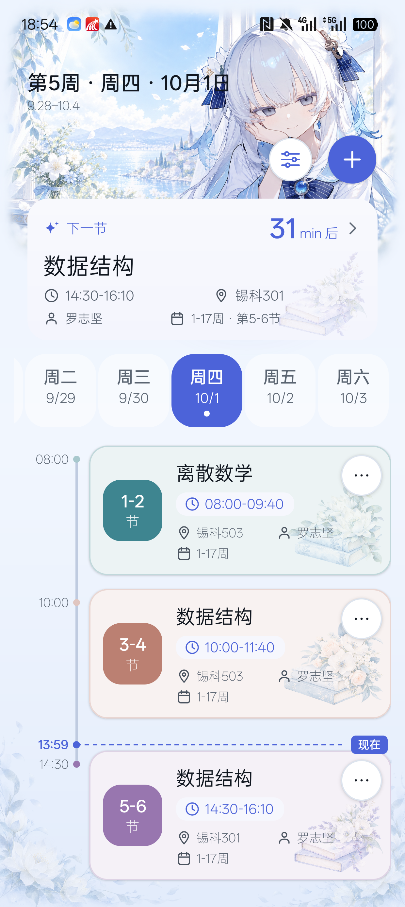
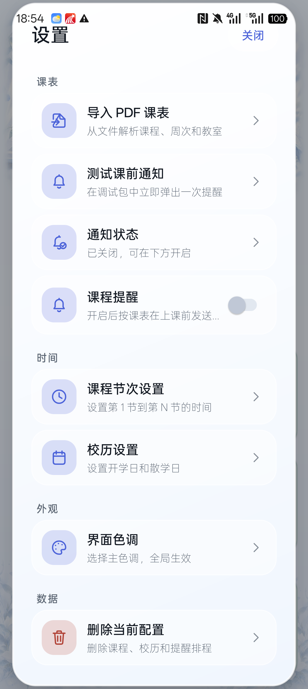

# 东雪莲定制课表

一款离线使用的 Android 课表，采用浅蓝、白色和东雪莲水彩主题。可以手动管理课程，也可以导入学校导出的文字版 PDF 课表；首页显示教学周、下一节课程、倒计时和当天的时间线。

使用 Java 原生界面和 Material 组件，支持 Android 6.0（API 23）及以上。应用没有网络权限，课程保存在本机，无广告和统计服务。

## 下载

从 [GitHub Releases](https://github.com/YUYU-Fish2/DongXuelian-Custom-Timetable/releases) 下载 APK。当前版本为 `1.3.0-preview`（`versionCode 6`）。

- 日常试用选择 `dongxuelian-timetable-v1.3.0-preview.apk`，已进行代码压缩和资源裁剪。
- `.zip` 是同一个 APK 的压缩下载包，解压后安装。
- `.validation` 和 AndroidTest 包用于开发验证，无需日常安装。

预览版使用调试证书签名。覆盖安装需要包名和签名与旧版一致；遇到签名冲突时，先确认旧版来源，卸载会清除本机课表。版本页面提供文件大小和 SHA-256 校验值。

## 界面

| 首页 | 设置 |
| --- | --- |
|  |  |

[课程编辑页](docs/screenshots/icon-background-refresh/course-edit.png) · [大字体窄屏](docs/screenshots/icon-background-refresh/narrow-130.png) · [单节进行中课程](docs/screenshots/icon-background-refresh/single-active.png)

截图采用固定测试课程、日期和主色，用于对比界面，不包含个人课表。

## 开始使用

1. 首次打开时填写本学期的开学日和散学日。日期必须写成 `YYYY-MM-DD`，例如 `2026-08-31` 和 `2027-01-16`，月份和日期都要补齐两位。教学周、倒计时和提醒都依赖这组校历。
2. 根据学校作息检查节次时间，再用加号添加课程，填写名称、星期、节次、周次、地点和教师。
3. 也可以在设置中选择 PDF 导入，核对识别结果后点击“确认导入”。同一天、重叠节次和重叠周次的课程会被判为冲突。
4. 如需上课提醒，开启通知权限，并按设置页提示检查系统闹钟权限。权限未开启时，页面会显示提醒状态。

星期栏支持周一到周日横向滑动。点击标题下的周范围可以查看其他教学周，预览时可以返回本周；“现在”线只在真实当前周的今天显示。

应用保留了原有的过期课程自动清理行为，已结束全部上课周的课程可能被删除。它适合日常查看当前学期，不宜作为历年课表档案。

## PDF 支持范围

导入器主要适配学校教务系统导出的文字版课表，读取课程名、周次、节次、教师和地点。通过系统文件选择器读取选定文件，不申请外部存储读写权限。

单个 PDF 上限为 5 MiB，解析后的课程总数上限为 200。扫描件和图片式 PDF 无法识别；部分字体编码、复杂排版或其他学校的模板也可能解析失败。目前没有完整的字体 CMap 支持，导入前请核对预览结果。

## 数据与权限

课程数据使用 Android Keystore 和 AES/GCM 加密保存。无法解密时会暂停保存，避免用空课表覆盖原密文；系统备份已关闭。当前没有云同步或课表备份导出，清除应用数据、卸载或丢失系统密钥都可能造成数据丢失。

通知、精确闹钟和开机后恢复提醒会用到相应系统权限。应用不申请 `INTERNET` 权限，也不上传课程或 PDF。

## 开发与验证

项目使用 Java 动态布局，保留原有包名 `com.example.meinstundenplan`，更名后沿用现有的数据标识。

准备 JDK 17、Android SDK 36.1 和 Build Tools 36.1.0，然后运行：

```powershell
$env:JAVA_HOME = "<JDK 目录>"
$env:ANDROID_HOME = "<Android SDK 目录>"
.\gradlew.bat --no-daemon :app:assemblePreview
```

产物位于 `app/build/outputs/apk/preview/app-preview.apk`。构建、签名、APK 打包和回归步骤见 [开发说明](docs/DEVELOPMENT.md)。

已有 UI 和功能验证在 RMX3700 / Android 16 上完成，包含课程编辑、PDF 确认、Keystore、通知和闹钟投递。不同宽度与字体比例通过同一手机调整密度测试，具体结果和未覆盖的场景见 [文档索引](docs/README.md)。每个发布版本的验证情况以该版本的 Release 说明为准。

## 来源与许可

本项目由 [KingRaindrop/Mein-Stundenplan](https://github.com/KingRaindrop/Mein-Stundenplan) 派生，在原有课表功能上进行修复和界面定制。感谢上游作者。

仓库目前没有 `LICENSE` 文件，未授予开源许可证。代码、角色形象和插画的权利需分别确认；水彩素材的制作记录见 [素材来源说明](docs/ICON-BACKGROUND-REFRESH-VALIDATION.md#asset-provenance)。项目名称和主题不代表角色权利方的官方产品或授权。
